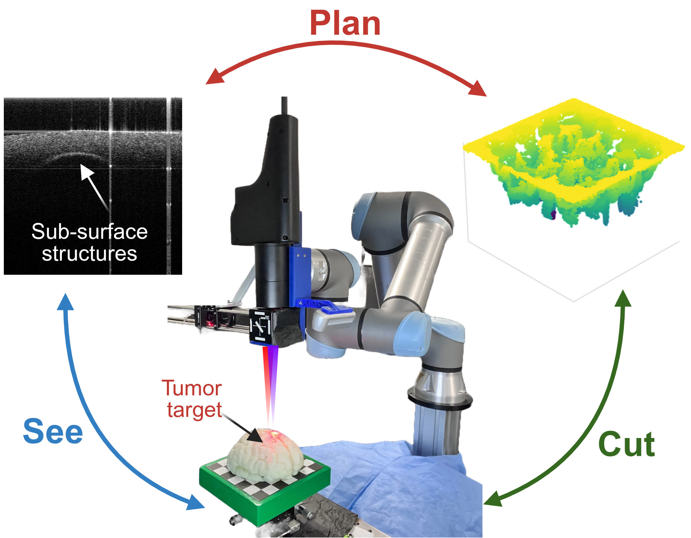
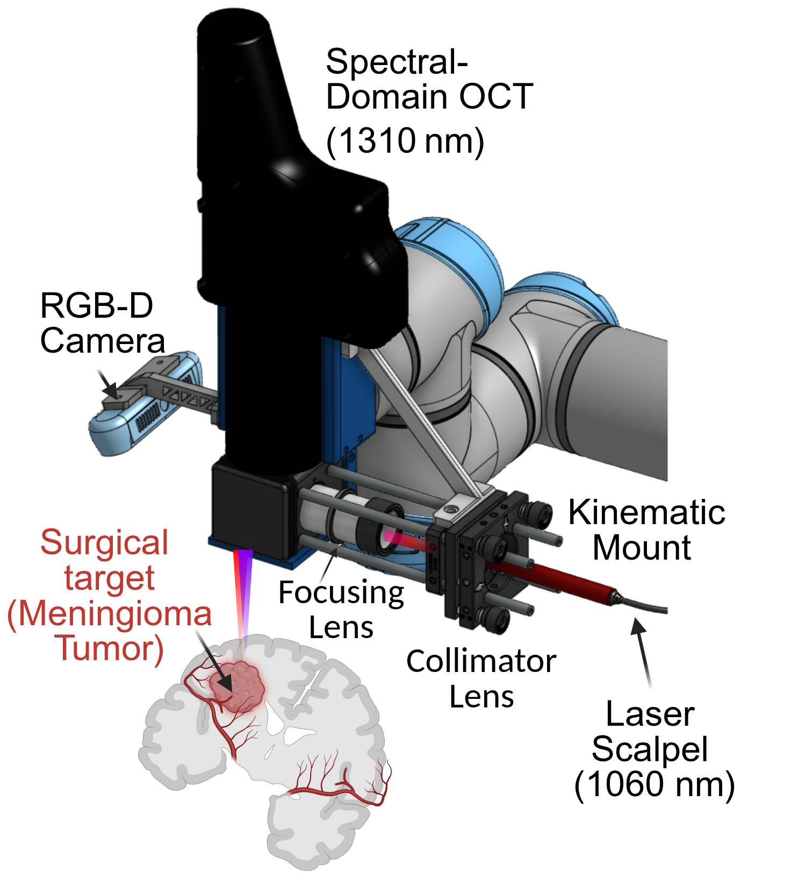

# See, Plan, Cut
### MPC-Based Autonomous Volumetric Robotic Laser Surgery with OCT Guidance

**Accepted at ICRA 2026**

*Ravi Prakash, Vincent Y. Wang, Arpit Mishra, Devi Yuliarti, Pei Zhong, Ryan P. McNabb, Patrick J. Codd, Leila J. Bridgeman*

[](https://arxiv.org/abs/2511.17777)
[](https://raprakashvi.github.io/see-plan-cut/)
[](https://2026.ieee-icra.org/)

📄 [arXiv](https://arxiv.org/abs/2511.17777) · 🌐 [Project website](https://raprakashvi.github.io/see-plan-cut/) · 🤖 [ICRA 2026](https://2026.ieee-icra.org/)

---



> *The **See → Plan → Cut** loop: OCT provides sub-surface tissue feedback, an MPC-based planner computes the optimal ablation sequence, and the UR5e robot delivers precise laser pulses — closing the loop autonomously.*

---

## Overview

Autonomous volumetric laser surgery requires tightly coupled sensing, planning, and execution. This work presents a closed-loop robotic system that integrates:

- **Spectral-domain OCT (1310 nm)** for real-time, sub-surface 3D tissue mapping
- **Model Predictive Control (MPC)** for optimal cut sequencing under safety constraints
- **1060 nm Nd:YAG laser scalpel** mounted co-axially on a **UR5e** robot arm

The result is a system capable of autonomously resecting a target tissue volume to a prescribed depth while respecting a hard constraint surface — without human intervention between shots.

---

## System Architecture



| Component | Specification |
|-----------|--------------|
| Robot | Universal Robots UR5e |
| Ablation laser | 1060 nm Nd:YAG, PWM-controlled via Raspberry Pi |
| Imaging sensor | Spectral-domain OCT, 1310 nm |
| RGB-D camera | Intel RealSense (hand-eye calibrated) |
| Optics | Collimator + focusing lens, kinematic mount |

---

## Key Contributions

1. **Closed-loop See–Plan–Cut framework** — the first to integrate OCT volumetric feedback with MPC-based trajectory optimization for laser ablation surgery.

2. **Physics-inspired ablation simulator** — a Super-Gaussian energy deposition model that captures crater geometry as a function of laser duty cycle, enabling accurate forward simulation for the planner.

3. **MPC planner** — iteratively selects the next optimal shot position and duty cycle to minimize residual volume while enforcing a hard depth constraint surface.

4. **Full hardware integration** — calibrated OCT-to-end-effector transform, RTDE-based robot control, and PWM laser control over socket, all orchestrated in a single autonomous pipeline.

---

## Repository Structure

```
.
├── ablation_crater_fitting.py     # Gaussian / Super-Gaussian crater fitting
├── laser_ablation.py              # Single-point ablation execution
├── oct_calib.py                   # OCT ↔ end-effector calibration
├── planned_cut_execute.py         # Execute a pre-planned cut sequence
│
├── planner/
│   ├── ablation_planner.py        # Greedy MPC cut sequence planner
│   └── cut_simulator.py           # Physics-inspired ablation simulator
│
├── ndyag_laser_control/
│   ├── laser_control_pwm.py       # High-level laser control interface
│   ├── laser_pwm_client.py        # Socket client for Raspberry Pi PWM server
│   └── code_4_pi/                 # Raspberry Pi PWM server
│
├── analysis/
│   ├── volume_resection_depthmap.py          # Pre/post depth maps & volume stats
│   ├── volume_resection_crater_analysis.py   # Crater-level analysis
│   ├── crater_fit_analysis.py                # Crater fit parameter visualization
│   ├── laser_calibration_error.py            # Spatial targeting accuracy
│   └── laser_power_repetability.py           # Power repeatability analysis
│
└── utils/
    ├── utils.py                   # Point cloud utils, robot motion helpers
    └── UR5Controller.py           # UR5e controller (PyBullet + RTDE)
```

---

## Quickstart

### 1. Install dependencies

```bash
pip install numpy scipy matplotlib pyvista open3d pybullet \
            rtde-python3 opencv-python plotly seaborn line_profiler
```

### 2. Calibrate OCT to end-effector

```bash
python oct_calib.py
```

Collect scans at varied robot poses. Hard-code the resulting `EE2OCT` matrix into `utils/UR5Controller.py`.

### 3. Plan a resection

```bash
cd planner && python ablation_planner.py
```

Outputs an `inputSeq` array: `[x, y, xAngle, yAngle, dutyCycle]` per shot.

### 4. Execute planned cuts

```bash
python planned_cut_execute.py
```

### 5. Single-point ablation

```bash
python laser_ablation.py
```

### 6. Analyze results

```bash
cd analysis && python volume_resection_depthmap.py
```

---

## Ablation Model

Each laser shot is modeled as a **Super-Gaussian** energy deposition:

$$z(x,y) = -A \exp\!\left(-\left(\frac{(x-\mu_x)^2+(y-\mu_y)^2}{2\sigma^2}\right)^P\right) + d$$

A truncated variant enforces a minimum ablation threshold $\phi$, preventing shallow over-deposition at crater edges. Parameters $(A, \sigma, P)$ are fit from experimental OCT crater scans.

---

## Citation

```bibtex
@article{prakash2025see,
  title   = {See, Plan, Cut: MPC-Based Autonomous Volumetric Robotic Laser Surgery with OCT Guidance},
  author  = {Prakash, Ravi and Wang, Vincent Y and Mishra, Arpit and Yuliarti, Devi and
             Zhong, Pei and McNabb, Ryan P and Codd, Patrick J and Bridgeman, Leila J},
  journal = {arXiv preprint arXiv:2511.17777},
  year    = {2025}
}
```

---

